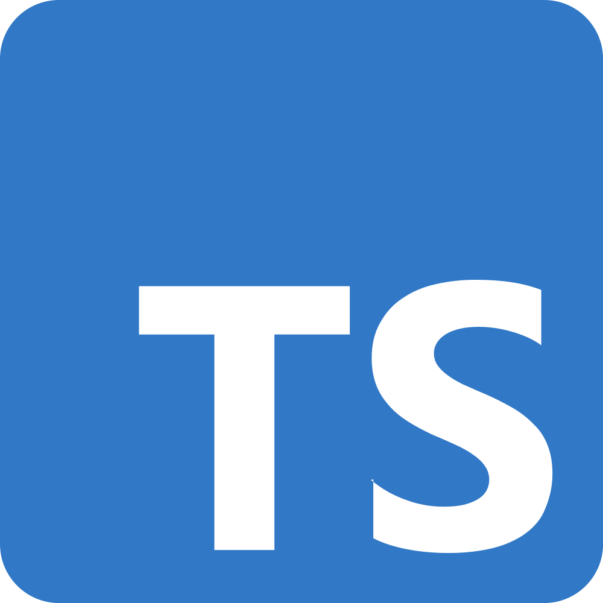

# Hi there 👋

## Someone informations about myself

- 👨‍💻 I have +3 years experience as a Full Stack Developer
- 👨‍💻 My favorite Tech's are **NodeJS, NestJS, MongoDB and React**
- 🌱 I’m currently learning **Python, SOLID Principles and Design Patterns**
- 🏢 Am i looking for jobs? ***YES***👍🏻
- 📫 My contact email is **<calebeoliver3@gmail.com>**
 
 

